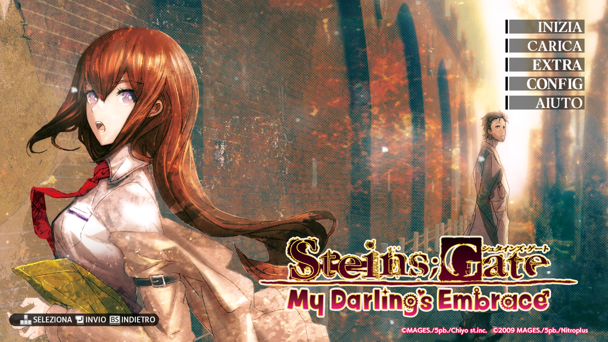
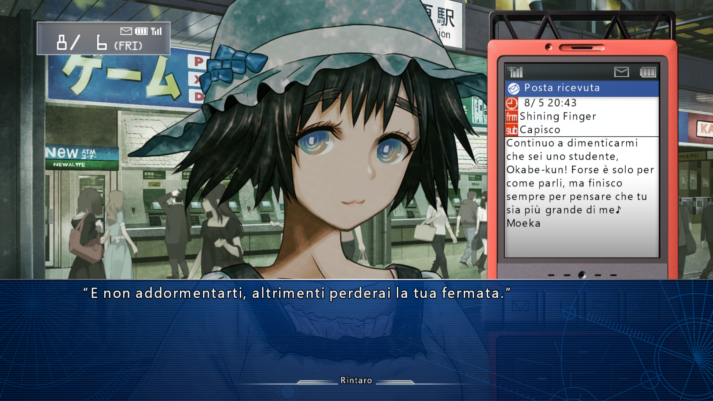
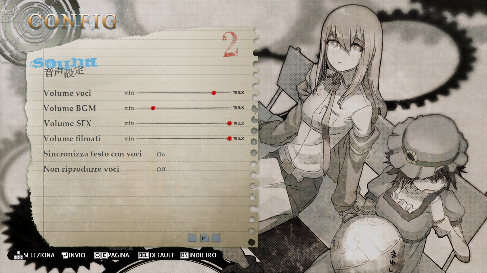
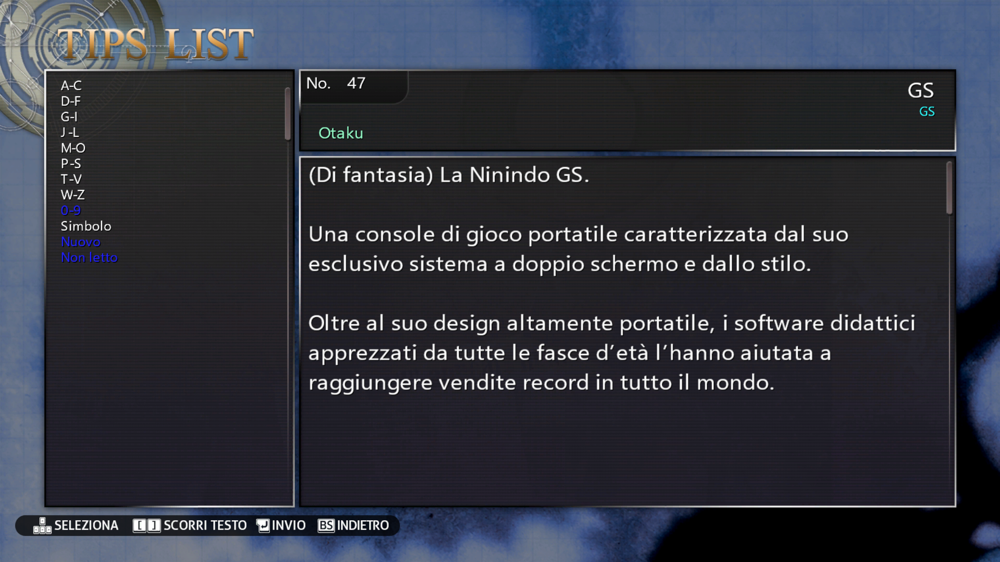
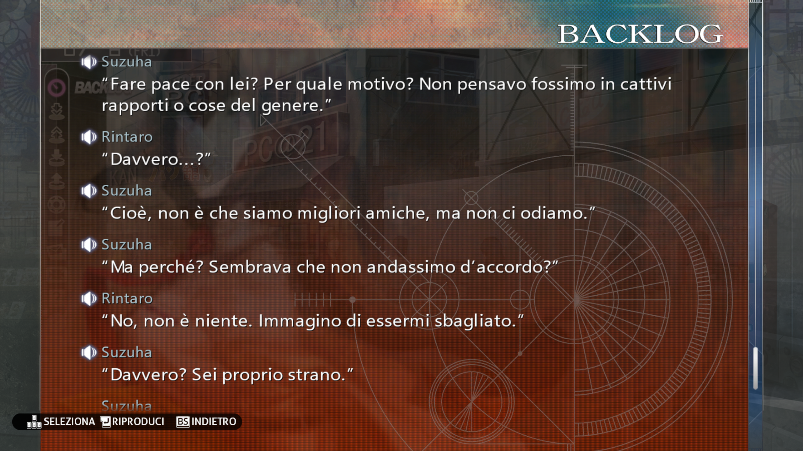

# STEINS;GATE: My Darling's Embrace — Traduzione Italiana

Patch di traduzione italiana per *STEINS;GATE: My Darling's Embrace* (Steam). È un progetto amatoriale che porto avanti da solo: traduzione, adattamento, font, script e i controlli per evitare refusi sono tutti a mio carico. Il testo è stato tradotto interamente dall'inglese.

La patch si appoggia come prerequisito alla STEINS;GATE: My Darling's Embrace Improvement Patch v1.0.0 del team Committee of Zero: il loro componente LanguageBarrier si occupa del redirect dei file a runtime (hooka le funzioni del motore per reindirizzare l'accesso agli asset), mentre `enscript.mpk`, dentro la cartella `languagebarrier`, è l'archivio che contiene gli script che vengono letti al posto di quelli originali — è lì dentro che viene iniettato il testo tradotto.

- **Guida completa all'installazione (con screenshot):** https://steamcommunity.com/sharedfiles/filedetails/?id=3757480800
- **Patch Committee of Zero (abbrev. "CoZ") (prerequisito):** https://sonome.dareno.me/projects/sgmde-patch.html
- **Download patch ITA:** link su MEGA riportato nella guida Steam qui sopra, oppure dalla sezione Release di questa stessa repository su GitHub

Questa repository raccoglie tutti gli script utilizzati, la documentazione del progetto e le Release della patch ITA (vedi sopra) — per la guida illustrata passo-passo con screenshot fate riferimento alla guida Steam.

## Screenshot

<table>
<tr>
<td width="50%"></td>
<td width="50%"></td>
</tr>
<tr>
<td width="50%"></td>
<td width="50%"></td>
</tr>
<tr>
<td colspan="2"></td>
</tr>
</table>

## Stato del progetto

| Versione | Data | Note |
|---|---|---|
| 1.0.0 | 04/07/2026 | Prima pubblicazione della patch ITA |
| 2.0.0 | in arrivo (settembre/ottobre 2026) | Revisione totale di dialoghi, e-mail e tips |
| X.X.X | entro la fine del 2026 | Traduzioni OP/ED, CG tradotte |

Changelog dettagliato in [CHANGELOG.md](CHANGELOG.md).

Il gioco è già completamente giocabile e godibile con la 1.0.0, ma qualche imperfezione in mail secondarie/tips verrà sistemata nelle prossime versioni.

## Installazione (riassunto)

Per la guida illustrata passo-passo con screenshot vedi il link Steam sopra. In breve:

1. Installa la patch Committee of Zero (prerequisito, obbligatoria)
2. Scarica ed estrai la patch ITA
3. Copia le cartelle `languagebarrier` e `USRDIR` nella cartella del gioco (default `...\Steam\steamapps\common\SG_My Darling's Embrace`), sovrascrivendo

Versione estesa in [docs/installazione.md](docs/installazione.md).

## Com'è fatta la patch (per chi vuole smanettare)

Pipeline usata per costruire la patch, dal testo grezzo al file di gioco:

- estrazione/reinserimento degli script tramite [sc3tools](https://github.com/CommitteeOfZero/sc3tools) (tool CLI di CoZ per leggere/modificare il testo nei file `.scx`.)
- archiviazione MPK (unpack/repack) con script Python scritti da zero (`mpkunpack.py` / `mpkrepack.py`)
- font: `charset.utf8`/`widths.bin` modificati sostituendo le voci dei glifi greci non utilizzati con quelle degli accentati italiani (non estendendoli con voci nuove, approccio abbandonato per problemi di posizionamento), così che [mgsfontgen-dx](https://github.com/CommitteeOfZero/mgsfontgen-dx) di CoZ generi i glifi giusti — il testo tradotto viene poi convertito sugli stessi slot con `greek_remap.py` prima del reinserimento
- texture DDS gestite direttamente in [GIMP](https://www.gimp.org/) (compressione BC3/DXT5, mipmaps generati — export diretto dal plugin DDS integrato)
- controllo sintassi con tool custom prima del reinserimento

Dettagli sui singoli tool in [tools/README.md](tools/README.md).

## Crediti

- **EnryTheBest_** — traduzione, adattamento, modifiche font, programmazione e tooling
- **[Committee of Zero](https://sonome.dareno.me/)** — autori della patch inglese su cui si basa questo progetto
- **[lgiacomazzo](https://github.com/lgiacomazzo)** (Steam: [taonor](https://steamcommunity.com/profiles/76561198074491836)) — autore delle traduzioni ITA di STEINS;GATE e STEINS;GATE 0, punto di riferimento importante per questo progetto
- **[Jonny](https://steamcommunity.com/profiles/76561198066602675)** — per aver messo a disposizione il filmato del prologo tradotto dalla sua patch

## Nota legale

In questa repository trovate solo strumenti e documentazione, non file del gioco. Per usare la traduzione serve una copia originale e legittima di STEINS;GATE: My Darling's Embrace su Steam, la patch Committee of Zero (prerequisito) e questa patch ITA (scaricabile da MEGA o dalle Release, vedi sopra).

STEINS;GATE: My Darling's Embrace è © 2009 MAGES./5pb./Nitroplus, concesso in licenza e pubblicato da Spike Chunsoft Co., Ltd. Questo è un progetto amatoriale e non ufficiale, non affiliato né approvato da nessuna delle società citate.

## Licenza

Il codice contenuto in questa repository è rilasciato sotto licenza MIT ([LICENSE](LICENSE)). Il testo tradotto e gli eventuali asset derivati dal gioco restano di proprietà dei rispettivi aventi diritto (vedi nota legale sopra).
