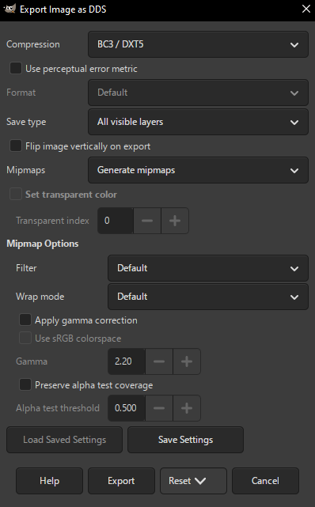

# Tooling

Script Python usati per costruire e validare la patch. Man mano che li ripulisco li carico qui.

## sc3tools

Non incluso in questa repository: uso il [tool ufficiale di Committee of Zero](https://github.com/CommitteeOfZero/sc3tools) (build locale, commit `ce94b06`, alias `steinsgatemde` per riconoscere il gioco). È un CLI per estrarre e modificare il testo nei file `.scx` (anche `.msb`, ma a noi non interessa in questo caso).

## mpkunpack.py / mpkrepack.py

Scritti da zero, ma il formato combacia esattamente con quello usato da Committee of Zero — lo script Python ufficiale nel repository sorgente [`CommitteeOfZero/sghd-patch`](https://github.com/CommitteeOfZero/sghd-patch/blob/master/mpkpack.py) (stesso approccio documentato anche in `sgmde-patch`). Stesso header, stesso TOC da 256 byte/entry, stesso allineamento a blocchi da 2048.

La differenza è nel workflow: `mpkrepack.py` legge l'intero MPK originale (TOC e dati), mantiene automaticamente i file non toccati e sostituisce solo quelli trovati nella cartella delle modifiche — nessun manifest da tenere aggiornato, più comodo per un workflow di traduzione iterativo con piccole modifiche frequenti. `mpkpack.py` di CoZ, invece, ricostruisce l'archivio da un **CSV manifest** che elenca ID, file sorgente e nome archivio per *ogni* file, anche quelli invariati (va mantenuto a mano). 

`mpkunpack.py` legge l'intero MPK originale (TOC e dati) e scrive su disco tutti i file contenuti, con un singolo comando anziché sessioni manuali file-per-file.

## greek_remap.py

Converte il testo tradotto tra caratteri accentati italiani e le lettere greche il cui slot nel font è già funzionante — non tocca `charset.utf8`/`widths.bin`, lavora sui file `.SCX.txt` prima del reinserimento con sc3tools. Comandi `to-greek` (prima di `sc3tools replace-text`) e `to-italian` (per rileggere/editare il testo in chiaro), con backup `.bak` automatico e modalità `--dry-run` per anteprima senza scrivere nulla.

## mgsfontgen-dx

Non è un mio script: è il [tool ufficiale di Committee of Zero](https://github.com/CommitteeOfZero/mgsfontgen-dx) per generare i font bitmap dei giochi su motore MAGES insieme alle relative tabelle di larghezza dei glifi (lette da LanguageBarrier). È lo stesso strumento usato da CoZ per i font delle loro patch di STEINS;GATE 0 e CHAOS;CHILD.

Per generare correttamente i glifi accentati, `charset.utf8` va modificato prima di lanciarlo: sostituendo le voci dei caratteri greci non utilizzati con quelle dei caratteri accentati italiani, non estendendolo con voci nuove (approccio abbandonato per problemi di posizionamento). Senza questa modifica, mgsfontgen-dx continuerebbe a generare i glifi greci originali invece degli accentati.

## syntax_check.py

Validatore per il testo tradotto, con 16 codici di errore (R01–R17). Ha una modalità `--fix` interattiva per correggere al volo.

## GIMP

Editor di immagini open source, usato per modificare manualmente le texture DDS/PNG dei menu. Per esportarle direttamente nel formato corretto: il plugin DDS è integrato di serie da GIMP 2.10.10 in poi, nessun plugin esterno da installare.

Impostazioni di export che ho utilizzato (`File` → `Export As...`, estensione `.dds`):

